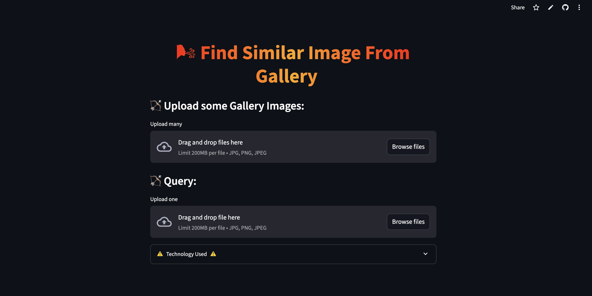

# 🧠 CLIP Image Similarity Finder — Streamlit + Transformers

A powerful **visual similarity search app** using the CLIP model to match uploaded query images against a gallery — all within an interactive Streamlit UI.

> ✅ Built with: `CLIP`, `Transformers`, `Streamlit`, `PIL`, `PyTorch`, `scikit-learn`


---

## 📸 Preview



---

## 🧠 Features

* 🖼️ Upload a **query image**
* 🗂️ Upload a set of **gallery images**
* 🔍 Get **top 3 visually similar** matches using CLIP embeddings
* 📊 Similarity scores shown using **cosine similarity**
* 🎨 Clean, minimal Streamlit UI

---

## 🚀 Getting Started

### 🔧 Prerequisites

* Python 3.8 or higher

---

### 🖥️ Local Installation

```bash
# 1. Clone this repo
git clone https://github.com/rakshath66/clipfindr.git
cd clipfindr

# 2. (Optional) Create a virtual environment
python -m venv venv
source venv/bin/activate  # or venv\Scripts\activate on Windows

# 3. Install dependencies
pip install -r requirements.txt

# 4. Run the app
streamlit run app.py
```

---

## 🗂️ Project Structure

```
clipfindr/
├── app.py                  # Streamlit app with CLIP visual search
├── gallery/                # Uploaded gallery images (auto-created)
├── requirements.txt        # Python dependencies
├── README.md               # This file
```

---

## 📚 Technology Used

* 🧠 [CLIP](https://huggingface.co/openai/clip-vit-base-patch32) from OpenAI
* 🤗 Hugging Face Transformers
* 🧮 PyTorch + TorchVision
* 📊 Cosine Similarity via scikit-learn
* 🎨 PIL for image handling
* 🖼️ Streamlit for the frontend

---

## 💡 Example Use Cases

* Product image deduplication
* Visual search for screenshots
* Reverse lookup from dataset images
* Similar fashion or object search

---

## 🔐 No API Keys Needed

CLIP is loaded directly via Hugging Face — no tokens required.

> Optional: To avoid rate limits, run `huggingface-cli login` if you have an account.

---

## ⭐ Contribute

### 🛠 Steps to contribute:

1. Fork the repo
2. Create a branch: `git checkout -b my-feature`
3. Make changes and commit: `git commit -m "Add: new feature"`
4. Push: `git push origin my-feature`
5. Open a pull request ✅

> Clean, modular contributions welcome!

---

## 📃 License

MIT License © [Rakshath U Shetty](https://github.com/rakshath66)

---

## 🛣️ Roadmap

### ✅ Phase 1: Core App

* CLIP-based similarity matching
* Top 3 results with similarity scores
* Clean Streamlit UI

### 🔜 Phase 2: Enhancements

* ✅ Save image metadata
* 🧠 Add text + image matching
* 🖼️ Visual heatmap of similarity
* 🌐 Optional: add BLIP-based captioning

---

### 🧑‍💻 Built by [Rakshath U Shetty](https://www.linkedin.com/in/rakshathushetty/)
